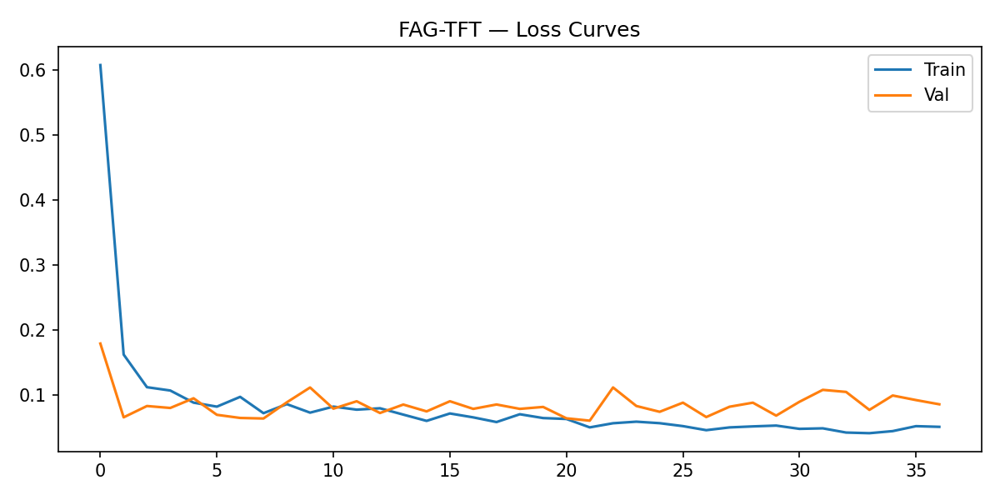
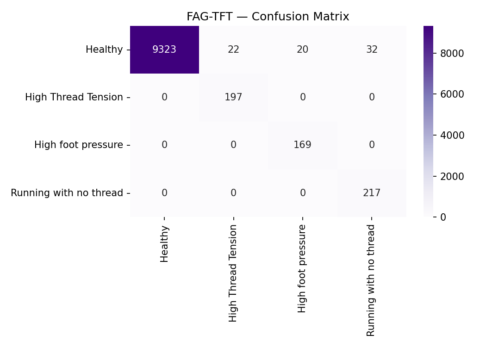
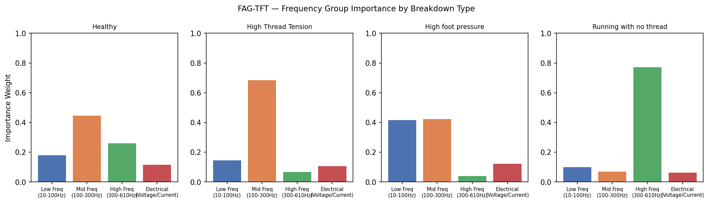
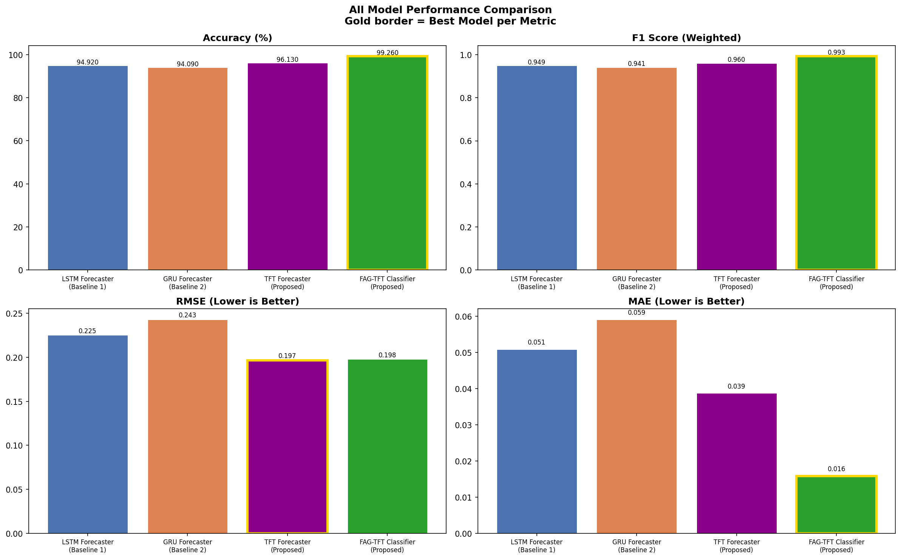

# FAG-TFT - Frequency Aware Gated Temporal Fusion Transformer

A deep learning system for predictive maintenance using time-series forecasting,
applied to industrial sewing machines.

## 🔍 What it does
The system works in two stages:
1. Detects whether a fault is coming (97.37% accuracy)
2. Identifies the fault type - HTT, HFP, or RNT (91.79% accuracy)

It reads 67 features from vibration and electrical sensors attached to the machine.

## 📁 Repo Structure
- `00_Data_Preparation.ipynb` - FFT processing and feature engineering
- `01 & 02` - LSTM and GRU baselines
- `03_FAG_TFT_Forecaster.ipynb` - Binary fault detector (Model A)
- `04_FAG_TFT.ipynb` - Fault type classifier (Model B)
- `05_Model_Comparison.ipynb` - All models compared
- `06_Live_Analyser.ipynb` - Real-time inference

## 📊 Results

| Model | Accuracy | F1 |
|---|---|---|
| FAG-TFT Binary (Model A) | 97.37% | 0.9739 |
| FAG-TFT Type (Model B) | 91.79% | 0.9190 |

### Training Loss


### Confusion Matrix


### Feature Group Importance


### Model Forecast Comparison


## 🚀 Run it
```bash
pip install torch numpy pandas matplotlib scikit-learn jupyter
```
Requires **Python 3.12.5** Then run notebooks in order from `00` to `06`.
